# Azure Bistro

Welcome to Azure Bistro, an enchanting restaurant management application developed using Django. This project promises an unforgettable user experience, catering to people of all ages looking to explore new culinary delights.

Azure Bistro is not just about dining; it's about convenience and simplicity. Users can effortlessly create an account, make a reservation, and modify their details as needed. The application is designed with user-friendly interfaces and features that appeal to a diverse audience, from tech-savvy youths to the elderly who appreciate simplicity.

As a school project, Azure Bistro is a testament to the application of Django in creating dynamic web applications. It showcases key functionalities such as user authentication, database management, and responsive web design, aiming to provide a comprehensive learning experience.

Dive into Azure Bistro and discover a world where technology meets culinary artistry!

[Azure Bistro - Deployed Site](https://azure-bistro-v2-df04593043a2.herokuapp.com/)

# Deployment to Heroku

This README outlines the steps necessary to deploy an application to Heroku. It is designed as a guide for users looking to deploy their own applications using Heroku's platform.

## Pre-Requisites

**Before beginning, ensure you have a Heroku account!**

## Steps for Deployment

1.  **Create a New App:**
 - Click on the *new* button in the upper right corner of the Heroku dashboard.
 - Select *Create new app*.

2. **App Name and Region:**
- Choose an app name. 
- Select a region closest to you for optimal performance.
- Click on *Create app* to confirm.

3. **Connecting to GitHub:**
- In the *Deploy* section of your app, select *GitHub* as the *Deployment method*.
- In *Connect to GitHub*, type in the name of your GitHub project.
- Click *Connect* next tot the project you wish to deploy.

4. Manual Deployment
- Scroll down to *Manual deploy* and click on the *Deploy Branch* button to initiate the deployment process.

# Testing

## HTML
W3C Markup Validation Service, a tool for checking the markup validity of web documents in HTML, was utilized to ensure that the website conforms to web standards.

**Errors in the landing page:** The validator showed the following errors,

**Error in the menu page:** The validator showed the following error,

**Restricted Pages:** An error occurred when it tried to analyze the page for users, in the console it wrote *'TypeError: 'AnonymousUser' object is not iterable'* for the following pages,
- Manage Reservations
- Edit Reservation
- Delete Reservation

I have since added @login_required in their views and thereby fixed the issue.
Once I fixed it, it gave me this info,

I have searched my entire file and cannot find what it is referring too, I think that it has something to do with django, since it only appeared when I added the @login_required to the viewpoints. I will seek assistance regarding this issue.

**Success:** No other pages showed any issues, and after having solved the minor issues shown in the home page and the menu page we are met by a success message,

## CSS
W3C CSS validation was used to validate the CSS of this project. No errors where found.

## Python
All Python code is written to the standards of PEP8. It has been double checked using the [Code Institute Python Linter](https://pep8ci.herokuapp.com/#)
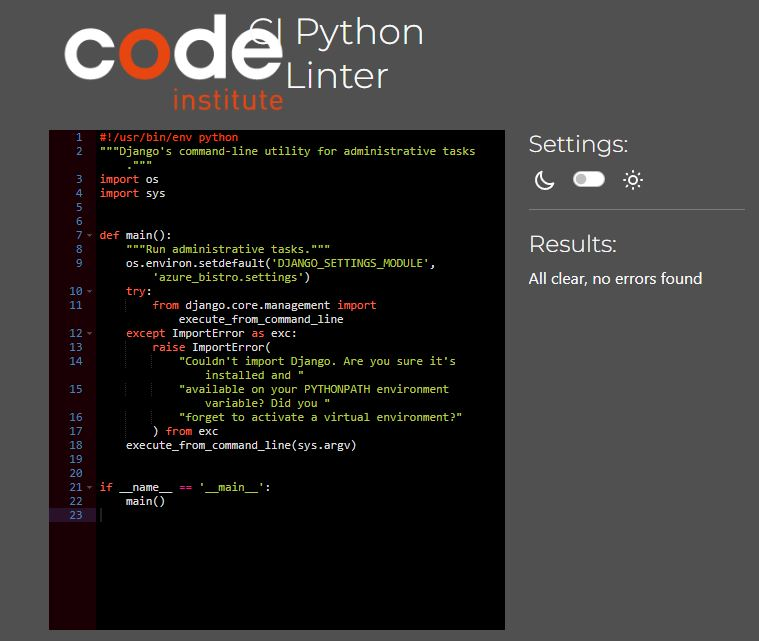

## Lighthouse

Lighthouse is an open-source tool for improving the quality of web pages. It provides audits for performance, accessibility, progressive web apps, and more. Below are the Lighthouse test results for the Azure Bistro website.

**Home Page - Desktop View**

**Home Page - Mobile View**

**Menu Page - Desktop View**

**Menu Page - Mobile View**

**Login Page - Desktop View**

**Login Page - Mobile View**

**Sign Up Page - Desktop View**

**Sign Up Page - Mobile View**

**Reservation Page - Desktop View**

**Reservation Page - Mobile View**

**Manage Reservation Page - Desktop View**

**Manage Reservation Page - Mobile View**

**Update Reservation Page - Desktop View**

**Update Reservation Page - Mobile View**

**Delete Reservation Page - Desktop View**

**Delete Reservation Page - Mobile View**

**Account Deletion Page - Desktop View**

**Account Deletion Page - Mobile View**

**Sign Out Page - Desktop View**

**Sign Out Page - Mobile View**

**All Reservations - Desktop View**

**All Reservations - Mobile View**

**Admin Update Reservations - Desktop View**

**Admin Update Reservations - Mobile View**

**Admin Delete Reservation - Desktop View**

**Admin Delete Reservation - Mobile View**

## Responsivity
The responsivity has been manually checked through devtools in google chrome. I also checked the website on my Samsung s9+
When in mobile view, most parts become a column so that it is easier to view. The *All Reservations* page is a table on tablets and cards on mobile screens. 

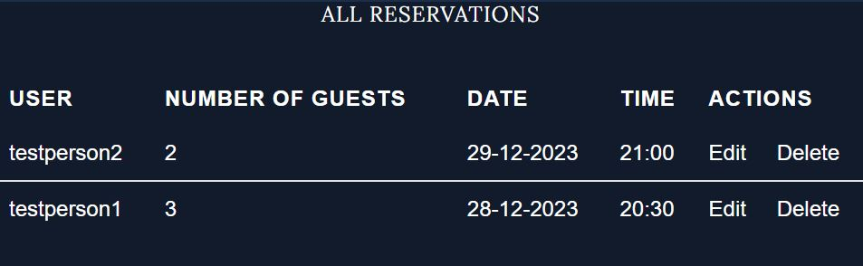

# Features

## Home Page

**Hero Section:** When the user enters the website they are greeted by the hero section. If they have not logged, there is a clear CTA button allowing them to do so. This button will change to *RESERVE TABLE* once they are logged in for convenience. It also has the restaurants opening hours and informational text.

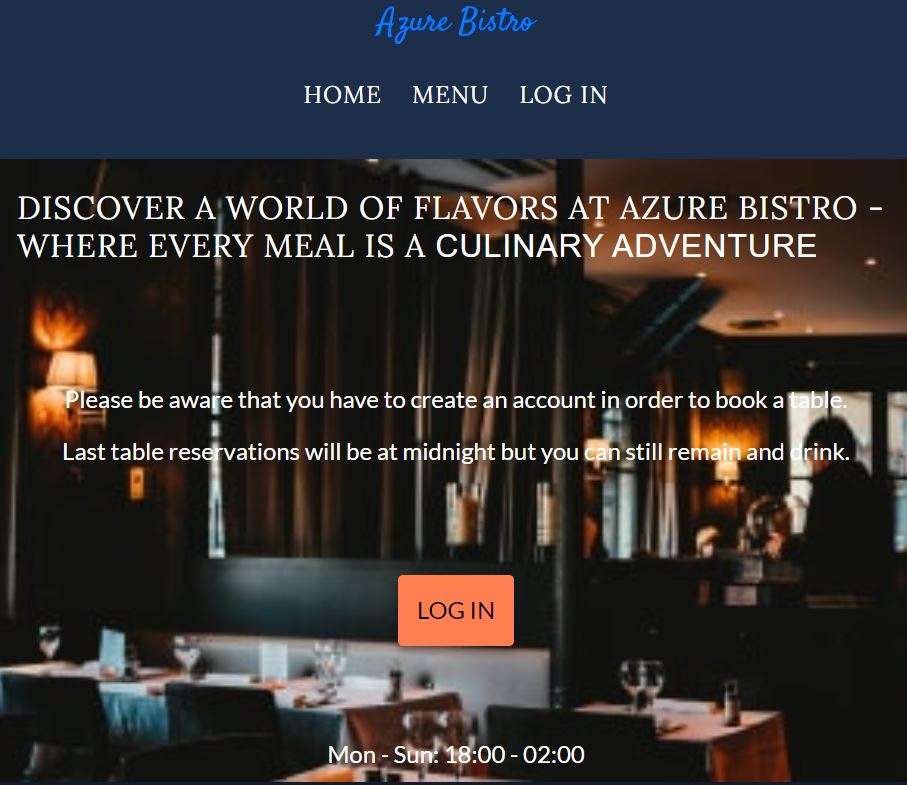

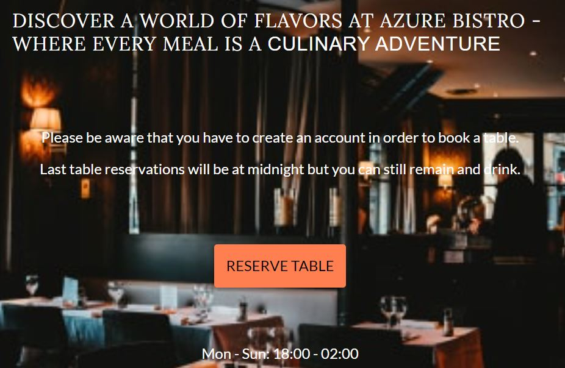

**Main Content:** Beneath the hero section are links with images to the menu page. A user can click on a category of their choosing and they will be directed to the corresponding section on the menu page. This allows users to quickly find what they are looking for on our menu.

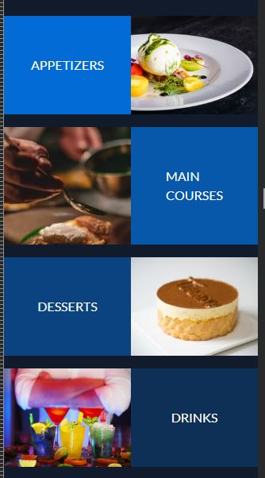

## Navbar

The navbar is at the top of the webpage no matter where the user is. It also follows the user down when they scroll so that they can always access it. Before the user is logged in they can only access the Home, Menu and Log In links.

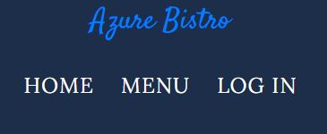

If they hover over the menu link or click on it on mobile view, a dropdown menu will appear with each section of the menu.

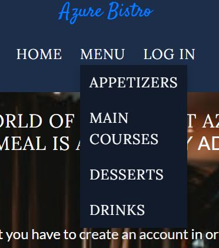

Once they login the login link will change to *Account* and a new link will appear called *Reservation*.

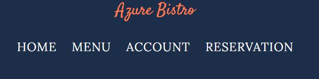

The account link will also be a dropdown menu that will show three other links. *Sign Out*, *Manage Reservation* and *Delete Account*. This will allow the user to quickly find relevant information.

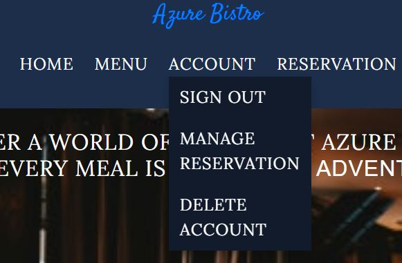

Above the navbar is the name of the restaurant which also functions as a link to the home page. When you hover over the various links they will turn color. Only the Menu and Account links wont turn color since they instead activate their dropdown menu. This gives the user feedback on what they are doing.

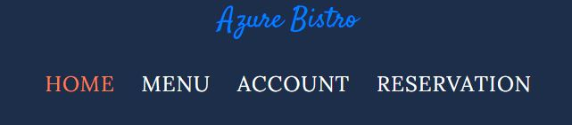

## Menu 

On the menu page, the user can find the entire menu and the prices of each item. This will allow them to plan in advance what they wish to eat.

## Footer

 In the bottom of every page there is the footer. With visiting and contact information and links to our social media. It also contains a small copyright text. This enables users to quickly find out the restaurants contact information no matter where they are on the page.

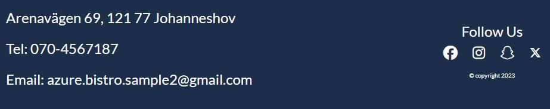

## Login Page 

Here the user can login and click on the remember me box. If they do not have an account, there is a link called *Create Account* which will take them to the account creation page. When the user is on an input field, it will be highlighted.

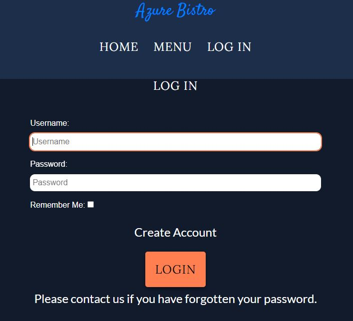

an error text will be shown if the user inputs the wrong login information.
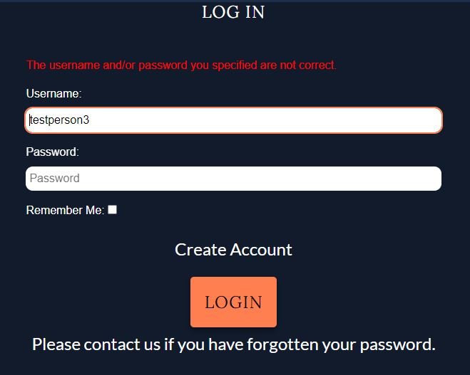

Once the user has logged in, they will be directed to the home page where a success message will be shown.
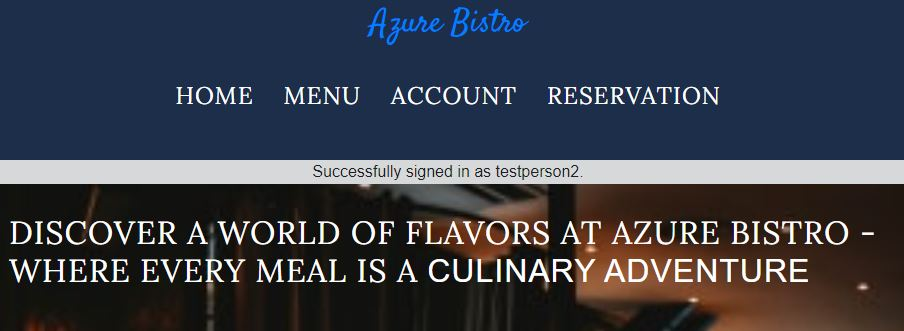

## Create Account Page

If the user does not have an account they can create one in seconds on the Create Account Page. All they need is a user name and password. 

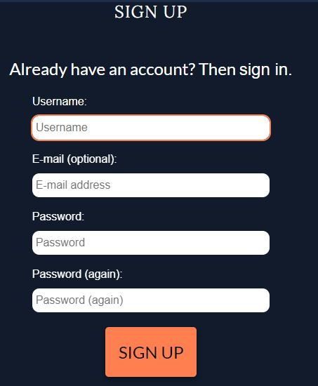

If the user name is taken an error message will pop up. An error will also occur if they leave anything but the email address blank.

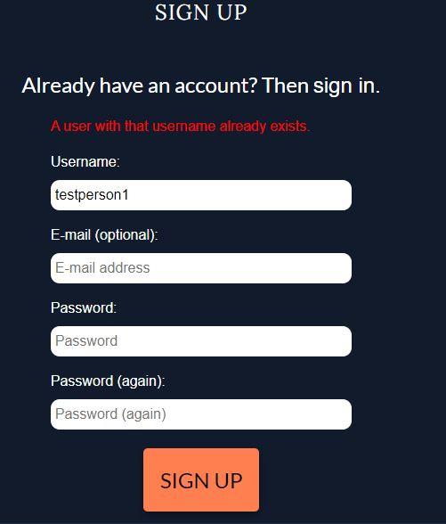

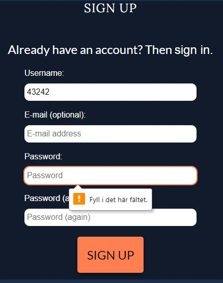

Once they register, they will be taken back to the main page and a success message will appear.

## Reservation Page

In the reservation page they can pick which date, time and the number of people they would like to book for. 

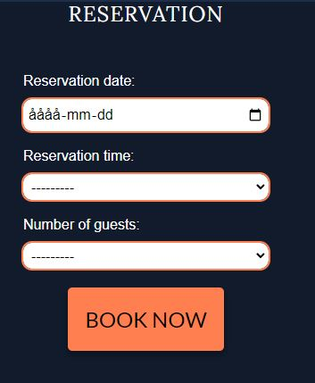

If the time is already booked or has passed, an error message will show up.

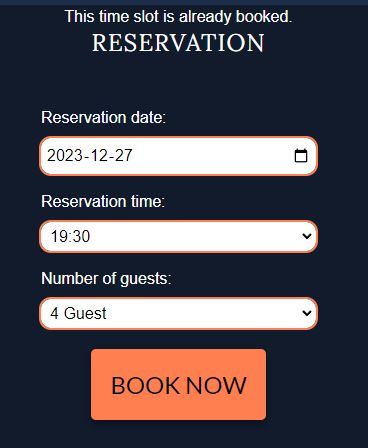

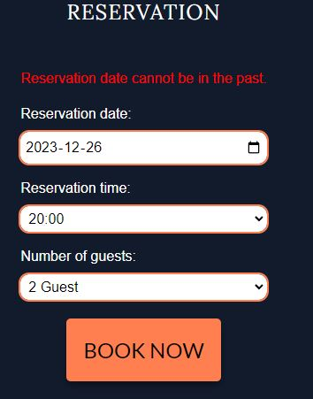

Once their reservation is complete, they will be taken back to the main page with a success message. This reservation will be shown in the Manage Reservation page, which they can access from their account.

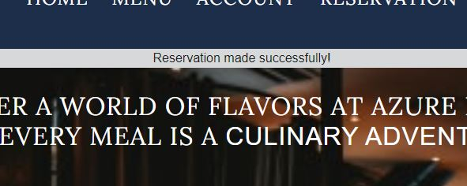

## Manage Reservation

Here the user can view all reservations they have made and the details of it. They can also edit or delete the reservation.

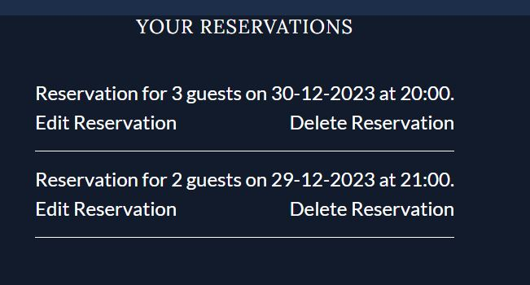

**Edit Reservation:** Once the user clicks on the button they will be brought to a page where they can edit their reservation. There is also a button that will take them back if they accidentaly clicked on the wrong reservation.

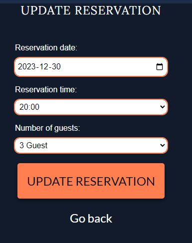

Once complete, they will be brought back to the *Manage Reservation* page and a success message will be seen.

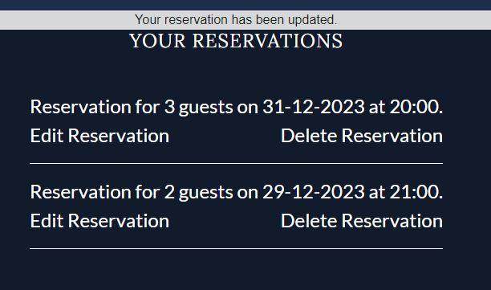

**Delete Reservation:** The user can also choose to delete a reservation by clicking the *Delete Reservation* button.

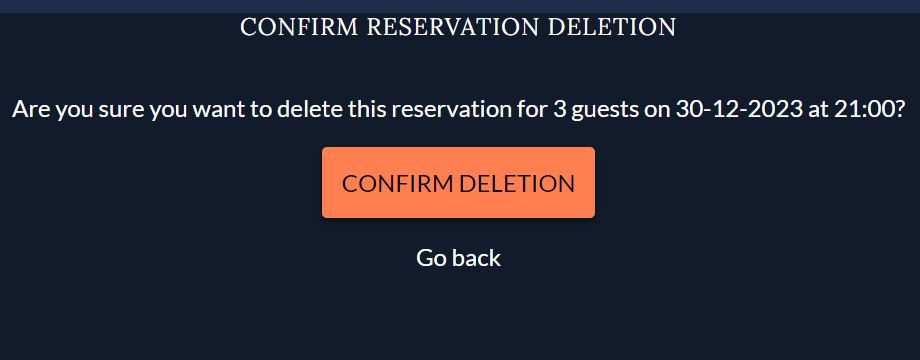

Once complete, they will be brought back to the *Manage Reservation* page and a success message will be seen.

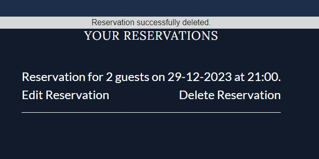

## Sign Out
The user can sign out of their account, by clicking on the sign out link in their account.
Once done they will be taken to the main page where the button on the hero-section and the links in the navbar have reverted back. A success message can also be seen.

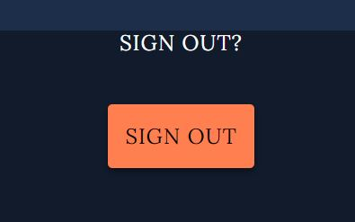

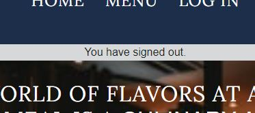

## Delete Account
The user can also choose to delete their account. This can be done from their account. They will have to confirm their decision by clicking on the *I confirm I want to delete my account:* checkbox.

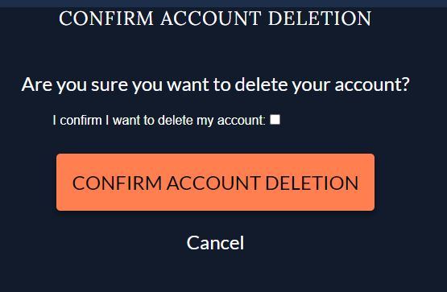

Once done, They will be brought back to the main page, where a success message will be shown. This will also delete all of their information from the database.

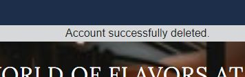

**Admin View:**

Before account deletion.

After account deletion.

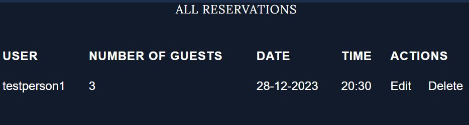

## Staff

When a staff member logs in there will be two extra links in their account, *Admin Panel* and *All Reservations*. 

If they click on the *Admin Panel* link, they will be taken to the django admin panel.
If they click on *All Reservations*, they will be taken to a page where they can view all the customers whom have made a reservation. 
The staff member can also choose to edit or delete a reservation from this page.

# Recources used
- [Django Project - Forms](https://docs.djangoproject.com/en/5.0/topics/forms/)

- [Django Project - Widgets](https://docs.djangoproject.com/en/5.0/ref/forms/widgets/)

- [Django Project - Validation](https://docs.djangoproject.com/en/5.0/ref/forms/validation/)

- [Django Project - Models](https://docs.djangoproject.com/en/5.0/topics/db/models/)

- [Django Project - Queries](https://docs.djangoproject.com/en/5.0/topics/db/queries/)

- [Django Project - Request-Response](https://docs.djangoproject.com/en/5.0/ref/request-response/)

- [Django Project - Messages](https://docs.djangoproject.com/en/5.0/ref/contrib/messages/)

- [Python - Datetime](https://docs.python.org/3/library/datetime.html)

- [Geeks For Geeks - args-kwargs-python](https://www.geeksforgeeks.org/args-kwargs-python/)

- [Youtube - Booking System For A Health Clinic](https://www.youtube.com/watch?v=s5xbtuo9pR0&t=102s)

- [Cloudinary](https://cloudinary.com/documentation)

- Conde Institute Projects - I think therefore I blog and Hello Django
