# Azure Bistro

Welcome to Azure Bistro, an enchanting restaurant management application developed using Django. This project promises an unforgettable user experience, catering to people of all ages looking to explore new culinary delights.

Azure Bistro is not just about dining; it's about convenience and simplicity. Users can effortlessly create an account, make a reservation, and modify their details as needed. The application is designed with user-friendly interfaces and features that appeal to a diverse audience, from tech-savvy youths to the elderly who appreciate simplicity.

As a school project, Azure Bistro is a testament to the application of Django in creating dynamic web applications. It showcases key functionalities such as user authentication, database management, and responsive web design, aiming to provide a comprehensive learning experience.

Dive into Azure Bistro and discover a world where technology meets culinary artistry!

[Azure Bistro - Deployed Site](https://azure-bistro-v2-df04593043a2.herokuapp.com/)

# Deployment to Heroku

This README outlines the steps necessary to deploy an application to Heroku. It is designed as a guide for users looking to deploy their own applications using Heroku's platform.

## Pre-Requisites

**Before beginning, ensure you have a Heroku account!**

## Steps for Deployment

1.  **Create a New App:**
 - Click on the *new* button in the upper right corner of the Heroku dashboard.
 - Select *Create new app*.

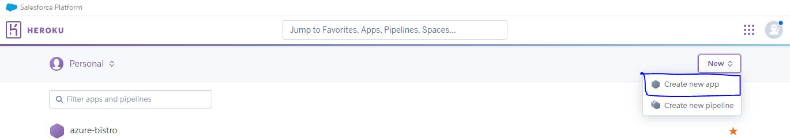

2. **App Name and Region:**
- Choose an app name. 
- Select a region closest to you for optimal performance.
- Click on *Create app* to confirm.

3. **Connecting to GitHub:**
- In the *Deploy* section of your app, select *GitHub* as the *Deployment method*.
- In *Connect to GitHub*, type in the name of your GitHub project.
- Click *Connect* next tot the project you wish to deploy.

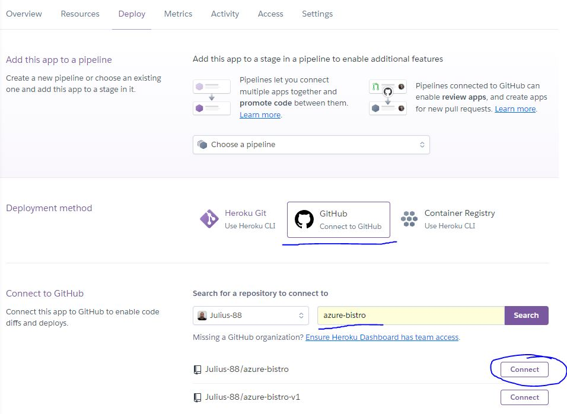

4. Manual Deployment
- Scroll down to *Manual deploy* and click on the *Deploy Branch* button to initiate the deployment process.

# Testing

## HTML
W3C Markup Validation Service, a tool for checking the markup validity of web documents in HTML, was utilized to ensure that the website conforms to web standards.

**Errors in the landing page:** The validator showed the following errors,
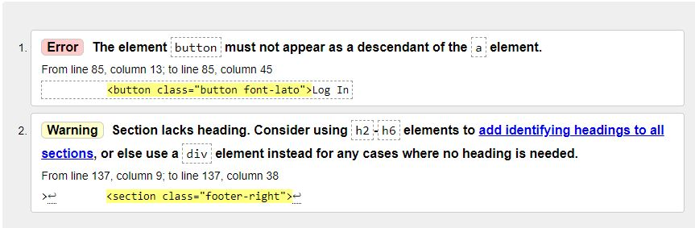

**Error in the menu page:** The validator showed the following error,
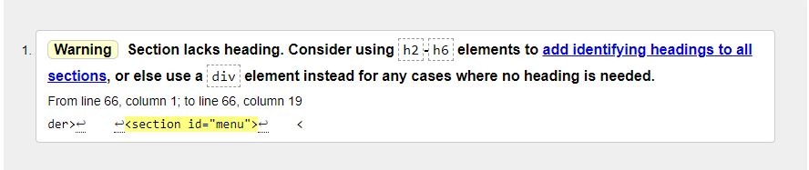

**Restricted Pages:** An error occurred when it tried to analyze the page for users, in the console it wrote *'TypeError: 'AnonymousUser' object is not iterable'* for the following pages,
- Manage Reservations
- Edit Reservation
- Delete Reservation

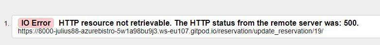

I have since added @login_required in their views and thereby fixed the issue.
Once I fixed it, it gave me this info,

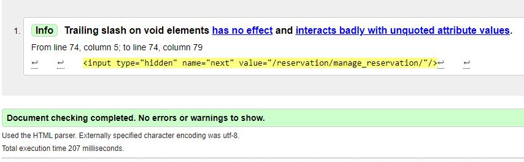

I have searched my entire file and cannot find what it is referring too, I think that it has something to do with django, since it only appeared when I added the @login_required to the viewpoints. I will seek assistance regarding this issue.

**Success:** No other pages showed any issues, and after having solved the minor issues shown in the home page and the menu page we are met by a success message,
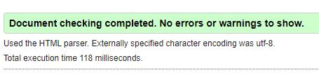

## CSS
W3C CSS validation was used to validate the CSS of this project. No errors where found.
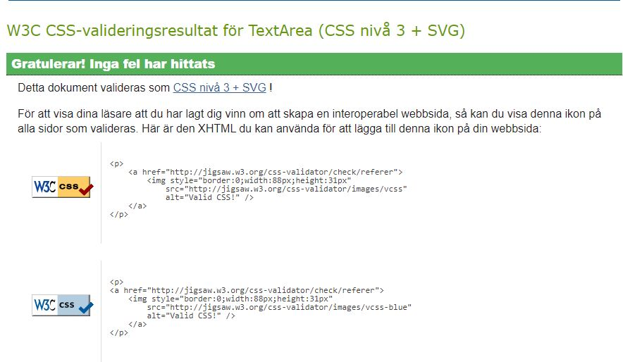

## Lighthouse

Lighthouse is an open-source tool for improving the quality of web pages. It provides audits for performance, accessibility, progressive web apps, and more. Below are the Lighthouse test results for the Azure Bistro website.

**Home Page - Desktop View**

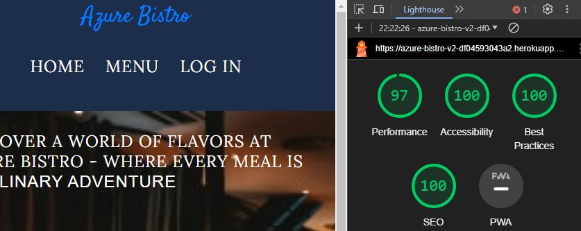

**Home Page - Mobile View**

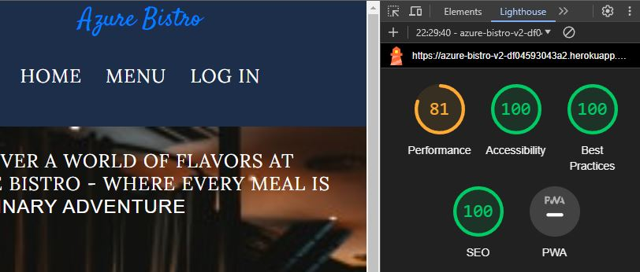

**Menu Page - Desktop View**

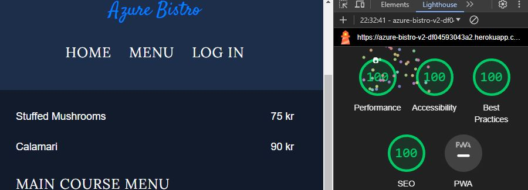

**Menu Page - Mobile View**

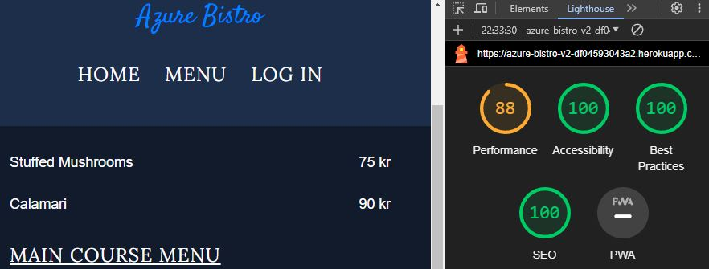

**Login Page - Desktop View**

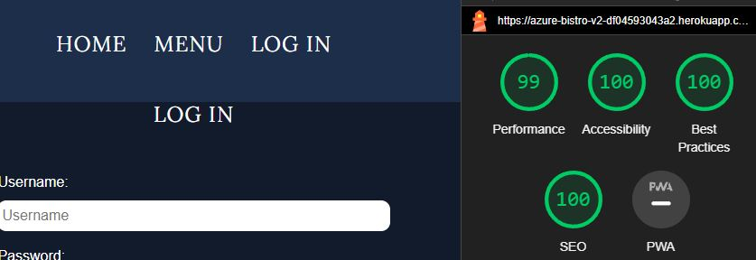

**Login Page - Mobile View**

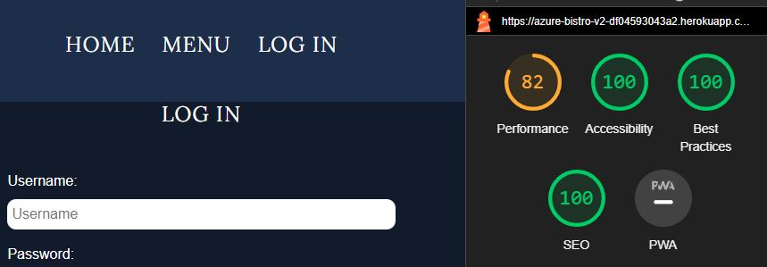

**Sign Up Page - Desktop View**

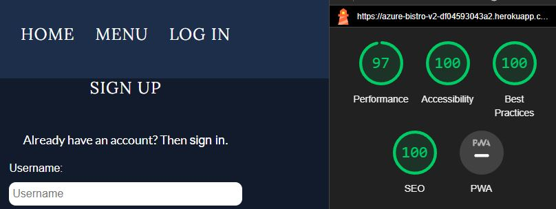

**Sign Up Page - Mobile View**

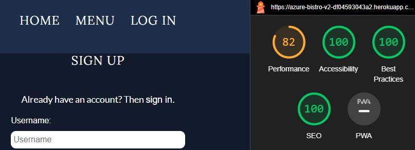

**Reservation Page - Desktop View**

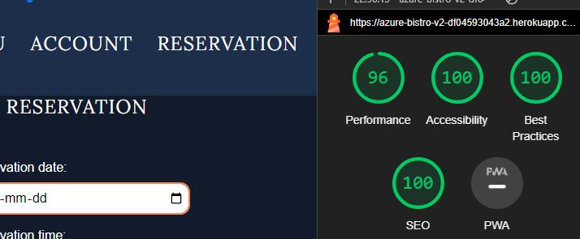

**Reservation Page - Mobile View**

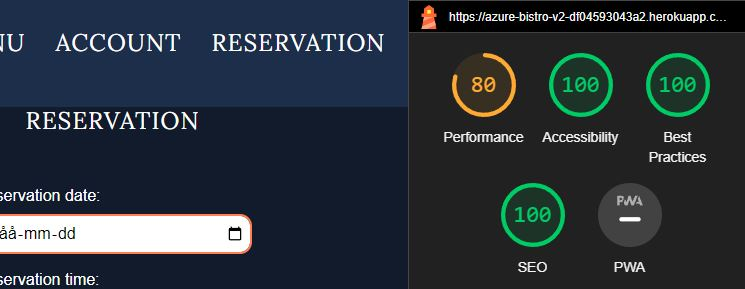

**Manage Reservation Page - Desktop View**

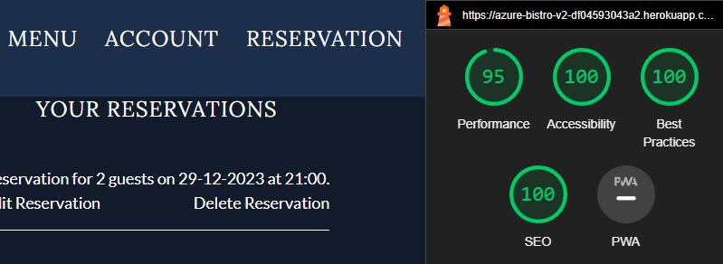

**Manage Reservation Page - Mobile View**

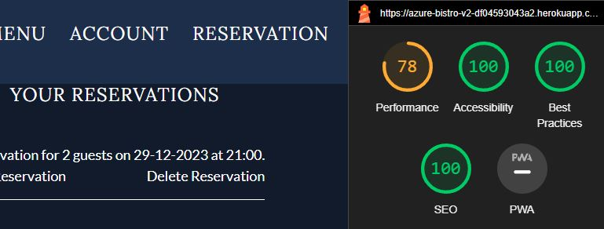

**Update Reservation Page - Desktop View**

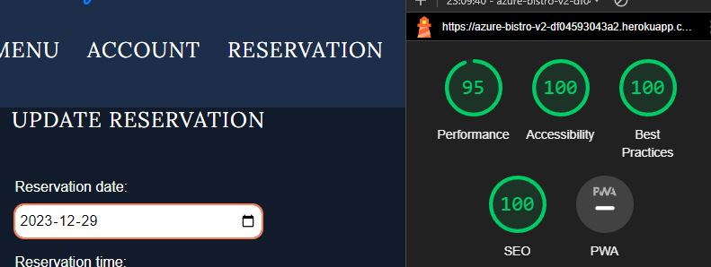

**Update Reservation Page - Mobile View**

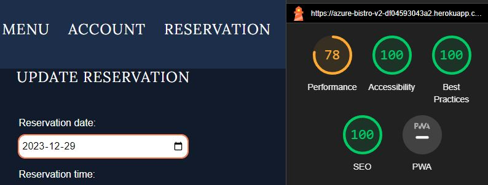

**Delete Reservation Page - Desktop View**

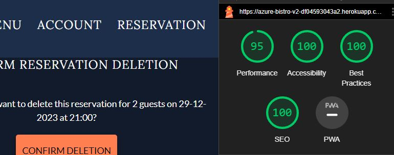

**Delete Reservation Page - Mobile View**

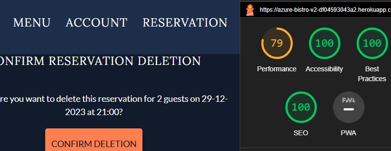

**Account Deletion Page - Desktop View**

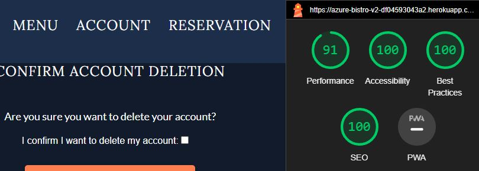

**Account Deletion Page - Mobile View**

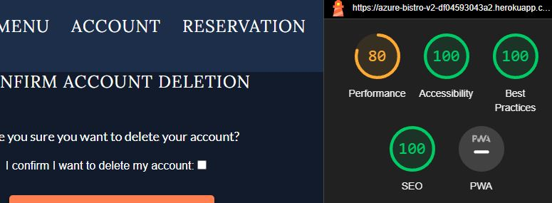

**Sign Out Page - Desktop View**

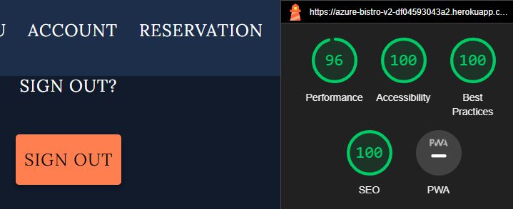

**Sign Out Page - Mobile View**

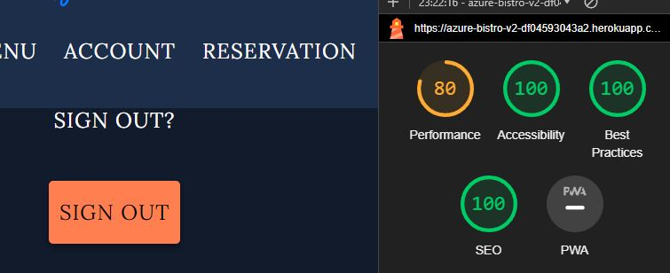

**All Reservations - Desktop View**

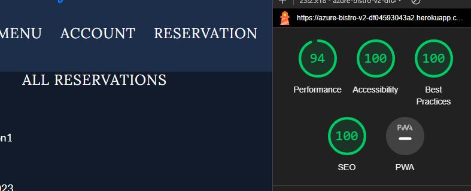

**All Reservations - Mobile View**

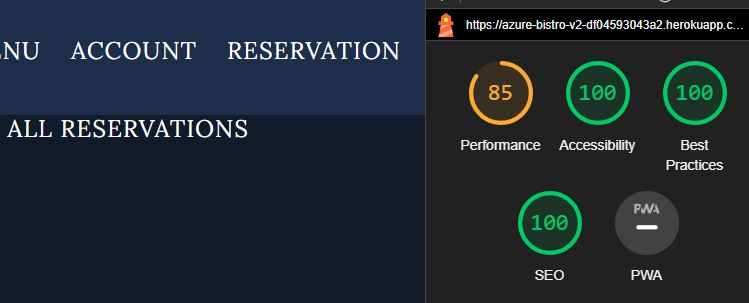

**Admin Update Reservations - Desktop View**

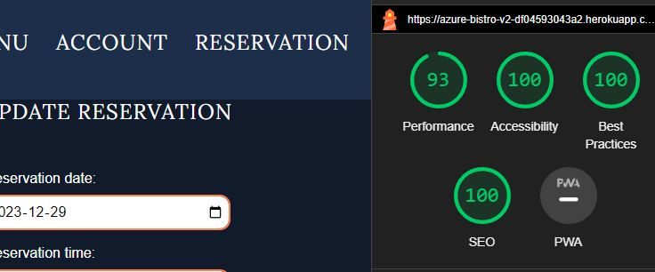

**Admin Update Reservations - Mobile View**

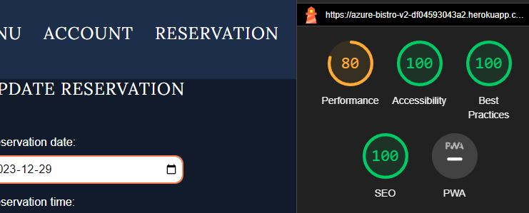

**Admin Delete Reservation - Desktop View**

**Admin Delete Reservation - Mobile View**

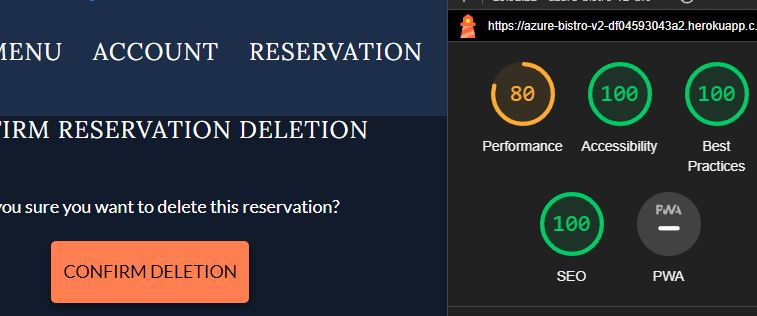

# Recources used
- [Django Project - Forms](https://docs.djangoproject.com/en/5.0/topics/forms/)

- [Django Project - Widgets](https://docs.djangoproject.com/en/5.0/ref/forms/widgets/)

- [Django Project - Validation](https://docs.djangoproject.com/en/5.0/ref/forms/validation/)

- [Django Project - Models](https://docs.djangoproject.com/en/5.0/topics/db/models/)

- [Django Project - Queries](https://docs.djangoproject.com/en/5.0/topics/db/queries/)

- [Django Project - Request-Response](https://docs.djangoproject.com/en/5.0/ref/request-response/)

- [Django Project - Messages](https://docs.djangoproject.com/en/5.0/ref/contrib/messages/)

- [Python - Datetime](https://docs.python.org/3/library/datetime.html)

- [Geeks For Geeks - args-kwargs-python](https://www.geeksforgeeks.org/args-kwargs-python/)

- [Youtube - Booking System For A Health Clinic](https://www.youtube.com/watch?v=s5xbtuo9pR0&t=102s)

- Conde Institute Projects - I think therefore I blog and Hello Django
